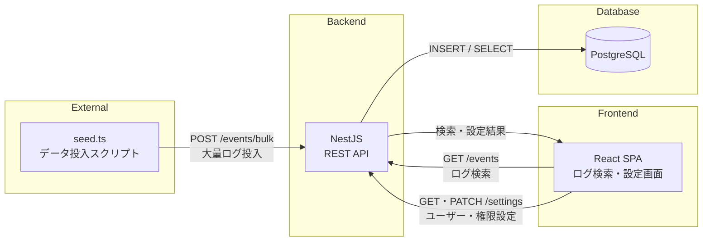
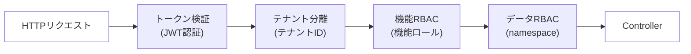

## プロダクト概要
実務でGoogle SecOpsの導入支援に関わる中で、導入よりも製品を作る側への思いが強くなり、ログ検索プラットフォームをテーマに設計・実装しました。\
ログ取込を始め、ログ検索、テナント分離、２軸（機能RBAC・データRBAC）独立の権限管理を実現しています。\
特に、テナント分離・権限管理はSaaSプロダクトの根幹機能のため、拡張性を意識して設計判断しました。\
※ バックエンドの設計・実装が主軸のため、フロントエンドは動作確認に必要な最低限の実装としています。

## 技術スタック
### バックエンド
- 言語：TypeScript
- フレームワーク：NestJS
- DB：PostgreSQL
- ORM：Prisma
- Test：Jest
### フロントエンド
- 言語：TypeScript
- フレームワーク：React
### インフラ
- 環境構築：Docker
- CI：Github Actions
- API仕様：OpenAPI（Swagger）

## アーキテクチャ図
### 全体構成

### 認証・認可フロー


## ER図
[ER図](./backend/ERD.md)

## テナント分離・２軸 (機能 / データRBAC) 独立の権限管理の設計
### テナント分離
- A社・B社の２社として定義
- DB上は新規テナントの追加が可能となるよう設計済み
### 機能RBAC
- 管理者・一般ユーザーの２ロールとして定義
- DB上は新規ロールの追加が可能となるよう設計済み
### データRBAC
- データ取込の際に、1イベント（ログ）単位でnamespaceを定義（実際には、取込方法ごとにnamespaceを定義する想定）
- A社ではnamespaceをA, B, Cで定義
- B社ではnamespaceをD, E, Fで定義
- 初期設定では、ユーザーAは、namespaceA, B, C全て表示。ユーザーBはnamespaceAのみ表示
- 同様に、ユーザーCは、namespaceD, E, F全て表示。ユーザーDはnamespaceDのみ表示
- 画面上で、各ユーザーのnamespace設定を変更可能
- DB上は新規namespaceの追加が可能となるよう設計済み

## デモアカウント一覧

| ユーザー | テナント | 機能RBAC | データRBAC | メールアドレス | パスワード |
|---------|---------|---------|-----------|--------------|-----------|
| A | A社 | 管理者 | namespace A, B, C | `user-a@example.com` | password123 |
| B | A社 | 一般ユーザー | namespace A のみ | `user-b@example.com` | password123 |
| C | B社 | 管理者 | namespace D, E, F | `user-c@example.com` | password123 |
| D | B社 | 一般ユーザー | namespace D のみ | `user-d@example.com` | password123 |

※ パスワードはデモ用です

## セットアップ手順
```bash
git clone https://github.com/bird-dance-dev/log-search-platform.git
cd log-search-platform
docker compose up
```
ブラウザで http://localhost:8080 にアクセスし、デモアカウントでログインしてください\
※ DB接続情報・JWT秘密鍵はdocker-compose.ymlにデフォルト値が設定されているため、.envの作成は不要です。本番環境では.envで適切な値を設定してください。

## 検索条件のサンプル
検索画面のフィルター欄に以下の形式で入力できます。
| 検索例 | 説明 |
|-------|------|
| （空欄のまま検索） | 全件表示 |
| `metadata_eventType = "NETWORK_HTTP"` | イベント種別で絞り込み |
| `metadata_logType = "OFFICE_365"` | ログタイプで絞り込み |
| `principal_user_email = "tanaka@corp.example.com"` | 行為者のメールアドレスで絞り込み |
| `principal_ip = "10.0.113.23"` | 行為者のIPアドレスで絞り込み |
| `securityResults.action = "BLOCK"` | セキュリティ結果のアクションで絞り込み |
| `securityResults.severity = "HIGH"` | セキュリティ結果の重大度で絞り込み |
| `securityResults.action != "BLOCK"` | ALLOW以外のアクションで絞り込み（!=） |
| `principal_user_email LIKE "tanaka"` | メールアドレスの部分一致検索（LIKE） |
| `metadata_eventType = "NETWORK_HTTP" AND principal_user_email = "tanaka@corp.example.com"` | AND条件で複合検索 |

※ 時間範囲はStart・Endにて指定できます。

## API一覧（Swagger）
http://localhost:3000/api#/ \
※ 開発・テスト用

## ローカル開発
PostgreSQLのみDockerで起動し、backend・frontendはローカルで動かす方法です。
```bash
# PostgreSQL起動
docker compose up postgres -d

# Backend起動
cd backend
cp .env.example .env
npm install
npx prisma migrate deploy
npm run start:dev

# Frontend起動（別ターミナル）
cd frontend
npm install
npm run dev
```
ブラウザで http://localhost:5173 にアクセスしてください。\
※ DB接続情報は.env.exampleをコピー

## 大量データ投入
登録・検索パフォーマンスを検証したい場合、CLIで件数を指定してログデータを投入できます。
```bash
cd scripts
npm install
npx tsx seed.ts --count 100
```
※ バックエンドが起動している状態で実行してください。
- 「--count」ではテナントあたりのログ数を指定します。
- ログタイプ6種 × 2テナント分のデータが生成されます。
- 例：「--count 100」→ 各ログタイプ17件 × 6種 × 2テナント = 204件
### 投入速度の目安
| 件数 | 所要時間 |
|------|---------|
| 10万件 | 57秒 |
| 100万件 | 約16分（978秒） |