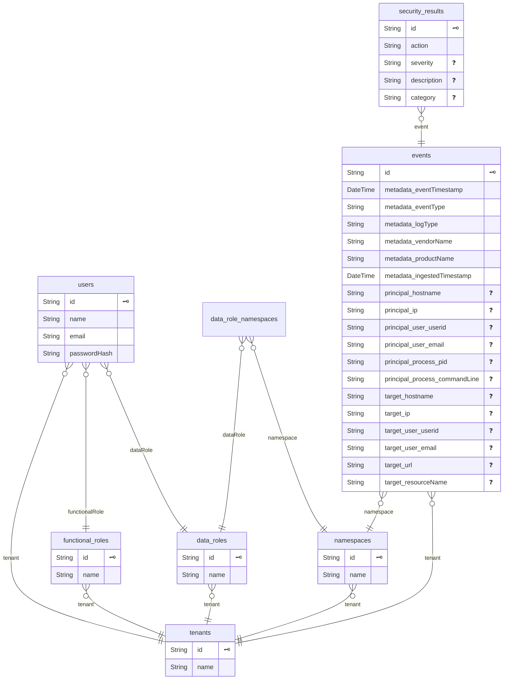

```mermaid
erDiagram

  "tenants" {
    String id "🗝️"
    String name 
    }
  

  "users" {
    String id "🗝️"
    String name 
    String email 
    String passwordHash 
    }
  

  "functional_roles" {
    String id "🗝️"
    String name 
    }
  

  "data_roles" {
    String id "🗝️"
    String name 
    }
  

  "namespaces" {
    String id "🗝️"
    String name 
    }
  

  "data_role_namespaces" {

    }
  

  "events" {
    String id "🗝️"
    DateTime metadata_eventTimestamp 
    String metadata_eventType 
    String metadata_logType 
    String metadata_vendorName 
    String metadata_productName 
    DateTime metadata_ingestedTimestamp 
    String principal_hostname "❓"
    String principal_ip "❓"
    String principal_user_userid "❓"
    String principal_user_email "❓"
    String principal_process_pid "❓"
    String principal_process_commandLine "❓"
    String target_hostname "❓"
    String target_ip "❓"
    String target_user_userid "❓"
    String target_user_email "❓"
    String target_url "❓"
    String target_resourceName "❓"
    }
  

  "security_results" {
    String id "🗝️"
    String action 
    String severity "❓"
    String description "❓"
    String category "❓"
    }
  
    "users" }o--|| tenants : "tenant"
    "users" }o--|| functional_roles : "functionalRole"
    "users" }o--|| data_roles : "dataRole"
    "functional_roles" }o--|| tenants : "tenant"
    "data_roles" }o--|| tenants : "tenant"
    "namespaces" }o--|| tenants : "tenant"
    "data_role_namespaces" }o--|| data_roles : "dataRole"
    "data_role_namespaces" }o--|| namespaces : "namespace"
    "events" }o--|| tenants : "tenant"
    "events" }o--|| namespaces : "namespace"
    "security_results" }o--|| events : "event"
```
