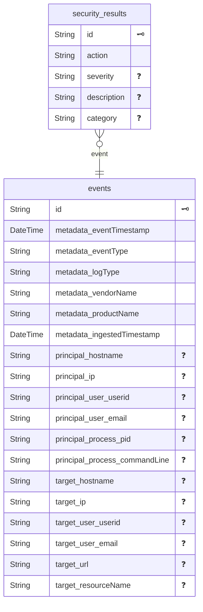

```mermaid
erDiagram

  "events" {
    String id "🗝️"
    DateTime metadata_eventTimestamp 
    String metadata_eventType 
    String metadata_logType 
    String metadata_vendorName 
    String metadata_productName 
    DateTime metadata_ingestedTimestamp 
    String principal_hostname "❓"
    String principal_ip "❓"
    String principal_user_userid "❓"
    String principal_user_email "❓"
    String principal_process_pid "❓"
    String principal_process_commandLine "❓"
    String target_hostname "❓"
    String target_ip "❓"
    String target_user_userid "❓"
    String target_user_email "❓"
    String target_url "❓"
    String target_resourceName "❓"
    }
  

  "security_results" {
    String id "🗝️"
    String action 
    String severity "❓"
    String description "❓"
    String category "❓"
    }
  
    "security_results" }o--|| events : "event"
```
